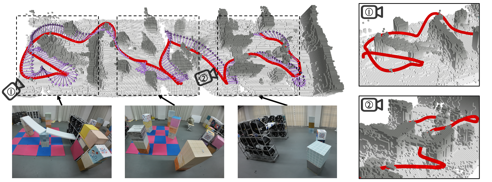
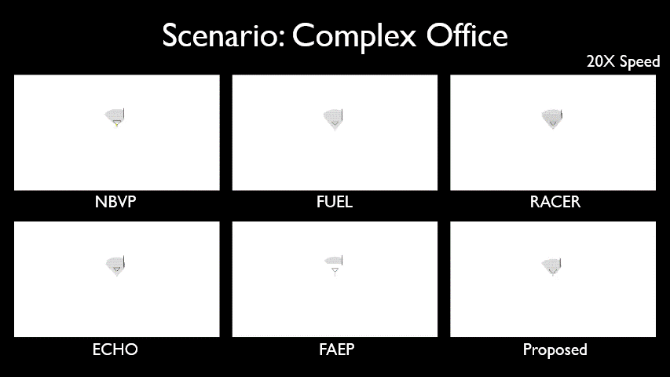
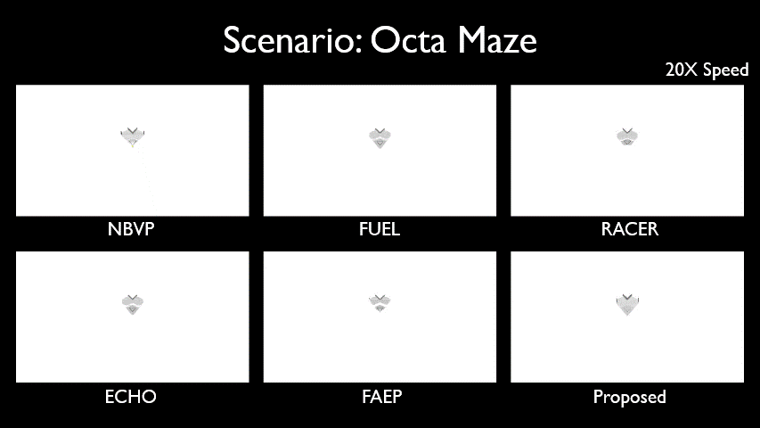
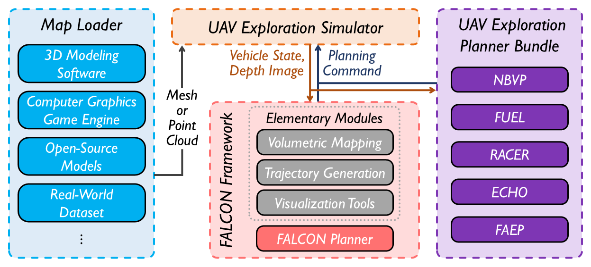

# FALCON

<div align="center">
<a href="https://arxiv.org/abs/2407.00577">

</a>
<a href="https://youtu.be/BGH5T2kPbWw?si=IhqfbJUHRwuWiWas">

</a>
<a href="https://www.bilibili.com/video/BV1TM4m1C7yi">

</a>
</div>

This is the code repository for the paper contributed to IEEE T-RO: 

**[FALCON: Fast Autonomous Aerial Exploration using Coverage Path Guidance](https://ieeexplore.ieee.org/document/10816079)**

**Authors**: [Yichen Zhang](https://yzhangec.github.io/)\*, [Xinyi Chen](https://xchencq.github.io/)\*, [Chen Feng](https://chen-albert-feng.github.io/AlbertFeng.github.io/), [Boyu Zhou](https://robotics-star.com/people), and [Shaojie Shen](https://uav.hkust.edu.hk/group/).

This paper introduces FALCON, a Fast Autonomous aerial robot expLoration planner using COverage path guidaNce. FALCON effectively harnesses the full potential of online generated coverage paths in enhancing exploration efficiency. We also introduce a lightweight exploration planner evaluation environment that allows for comparing exploration planners across a variety of testing scenarios using an identical quadrotor simulator.

<div align="center">

</div>

Please cite our paper if you use this project in your research:

Zhang, Y., Chen, X., Feng, C., Zhou, B., & Shen, S. (2024). FALCON: Fast Autonomous Aerial Exploration using Coverage Path Guidance. IEEE Transactions on Robotics.
```
@article{zhang2024falcon,
  title={FALCON: Fast Autonomous Aerial Exploration Using Coverage Path Guidance}, 
  author={Zhang, Yichen and Chen, Xinyi and Feng, Chen and Zhou, Boyu and Shen, Shaojie},
  journal={IEEE Transactions on Robotics}, 
  year={2024},
  volume={41},
  pages={1365-1385},
  doi={10.1109/TRO.2024.3522148}
}
```

Please kindly star :star: this project if it helps you. Thanks for your support! :sparkling_heart:

## Contents
- [FALCON](#falcon)
  - [Contents](#contents)
  - [Getting Started](#getting-started)
  - [Run](#run)
  - [Results](#results)
    - [Simulation Benchmark](#simulation-benchmark)
    - [Real-world Experiment](#real-world-experiment)
  - [Custom Exploration Scenarios](#custom-exploration-scenarios)
  - [Real-world UAV Deployment](#real-world-uav-deployment)
  - [Acknowledgements](#acknowledgements)
  - [To be included in the future](#to-be-included-in-the-future)

## Getting Started
The setup commands have been tested on Ubuntu 20.04 (ROS Noetic). If you are using a different Ubuntu distribution, please modify accordingly.

* Install dependencies
  ```
    # Install libraries
    sudo apt install libgoogle-glog-dev libdw-dev libdwarf-dev libarmadillo-dev
    sudo apt install libc++-dev libc++abi-dev
    
    # Install cmake 3.26.0-rc6 (3.20+ required)
    wget https://cmake.org/files/v3.26/cmake-3.26.0-rc6.tar.gz
    tar -xvzf cmake-3.26.0-rc6.tar.gz
    cd cmake-3.26.0-rc6
    ./bootstrap
    make 
    sudo make install
    # restart terminal

    # Install NLopt 2.7.1
    git clone --depth 1 --branch v2.7.1 https://github.com/stevengj/nlopt.git
    cd nlopt
    mkdir build && cd build
    cmake ..
    make -j
    sudo make install

    # Install Open3D 0.18.0
    cd YOUR_Open3D_PATH
    git clone --depth 1 --branch v0.18.0 https://github.com/isl-org/Open3D.git
    cd Open3D
    mkdir build && cd build
    cmake -DBUILD_PYTHON_MODULE=OFF ..    
    make -j # make -j4 if out of memory
    sudo make install
  ```
* Clone the repository
  ```
    cd ${YOUR_WORKSPACE_PATH}/src
    git clone https://github.com/HKUST-Aerial-Robotics/FALCON.git
    cd ..
    catkin_make
    source devel/setup.bash  
    # or
    source devel/setup.zsh  
  ```
## Run
* set CUDA_NVCC_FLAGS in `CMakeLists.txt` under pointcloud_render package. [More information](https://arnon.dk/matching-sm-architectures-arch-and-gencode-for-various-nvidia-cards/)
  ```
  set(CUDA_NVCC_FLAGS -gencode arch=compute_XX,code=sm_XX;)
  ```
* Config Open3D app path in mesh_render package
  ```
    # mesh_render.yaml
    mesh_render:
      open3d_resource_path: /YOUR_Open3D_PATH/Open3D/build/bin/resources
  ```
* Launch RViz visualization
  ``` 
    roslaunch exploration_manager rviz.launch
  ```
* Launch FALCON planner with predefined maps
  ```
    roslaunch exploration_manager exploration.launch map_name:="octa_maze"
  ```
  maps provided: 
  * classical_office
  * complex_office
  * darpa_tunnel
  * duplex_office
  * octa_maze
  * power_plant
  
  `auto_start` is used to start the exploration automatically, the default value is "true" in exploration_planner.yaml. If you want to start the exploration manually, please set it to "false".
  ```
    # exploration_planner.yaml
    exploration_manager:
      auto_start: true
  ```

## Results
### Simulation Benchmark
<div align="center">



</div>

### Real-world Experiment
<div align="center">

</div>

## Custom Exploration Scenarios
<div align="center">

</div>

The exploration planner evaluation environment (EPEE) supports custom maps input in point cloud (.pcd, .ply) or mesh (.stl) format. The provided maps are placed in the `resource` folder under the `map_render` package. This is the default relative path for the map file searching. 
You can use the provided maps or create your own maps from 3D modeling software (e.g., [SolidWorks](https://www.solidworks.com/), [OpenSCAD](https://openscad.org/), etc.) or existing contents (e.g., assets from [Unreal Fab](https://www.fab.com/), realistic maps in [MARSIM](https://github.com/hku-mars/MARSIM), etc.).
If you want to use your own maps at other locations, please put the map file under this folder or specify the full path in the map config file. 
 
The map config files are located in the `config/map` folder under the `exploration_manager` package.
For each map, you need to specify the initial pose of the UAV and the map size, task bbox size, and the visualization bbox size. Considering the map resource file may have a different corrdinate system, the `T_m_w` matrix is used to transform the map to the world frame for proper depth rendering. 

## Real-world UAV Deployment
It is recommended to use the [UniQuad](https://github.com/HKUST-Aerial-Robotics/UniQuad) platform for real-world UAV deployment. The UniQuad platform is a unified and versatile quadrotor platform series that offers high flexibility to adapt to a wide range of commontasks, excellent customizability for advanced demands, and easy maintenance in case of crashes. Our real-world UAV deployment is based on the **Uni250C** from the UniQuad platform.

## Acknowledgements
* [LKH](http://webhotel4.ruc.dk/~keld/research/LKH/): An effective implementation of the Lin-Kernighan heuristic for solving the traveling salesman problem
* [NLOpt](https://nlopt.readthedocs.io/): An open-source library for nonlinear optimization
* [Open3D](https://www.open3d.org/): An open-source library that supports rapid development of software that deals with 3D data
* [FUEL](https://github.com/HKUST-Aerial-Robotics/FUEL): a powerful framework for Fast UAV ExpLoration

## To be included in the future
- [ ] Lidar sensing from [MARSIM](https://github.com/hku-mars/MARSIM)
- [ ] Large-scale scenario (> 1e6 m^3) compatibility
- [ ] ROS2 support
